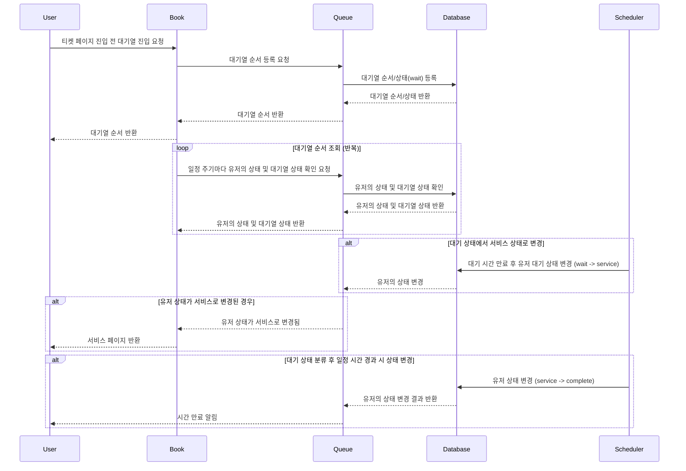
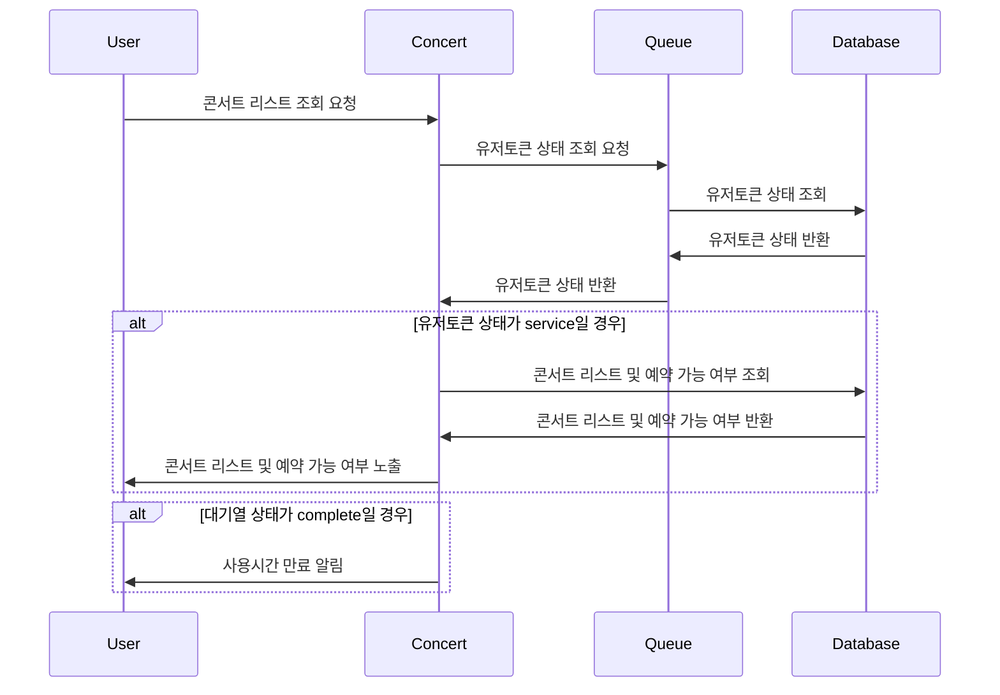
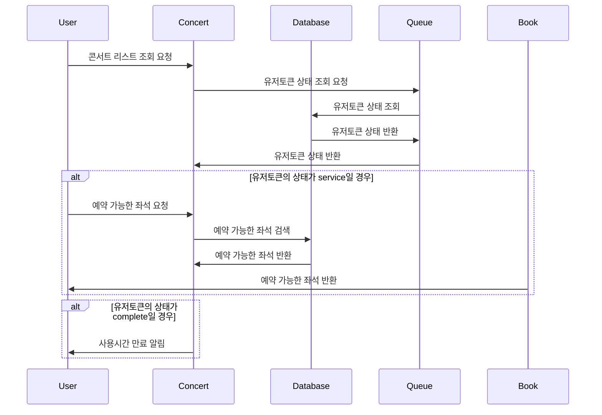
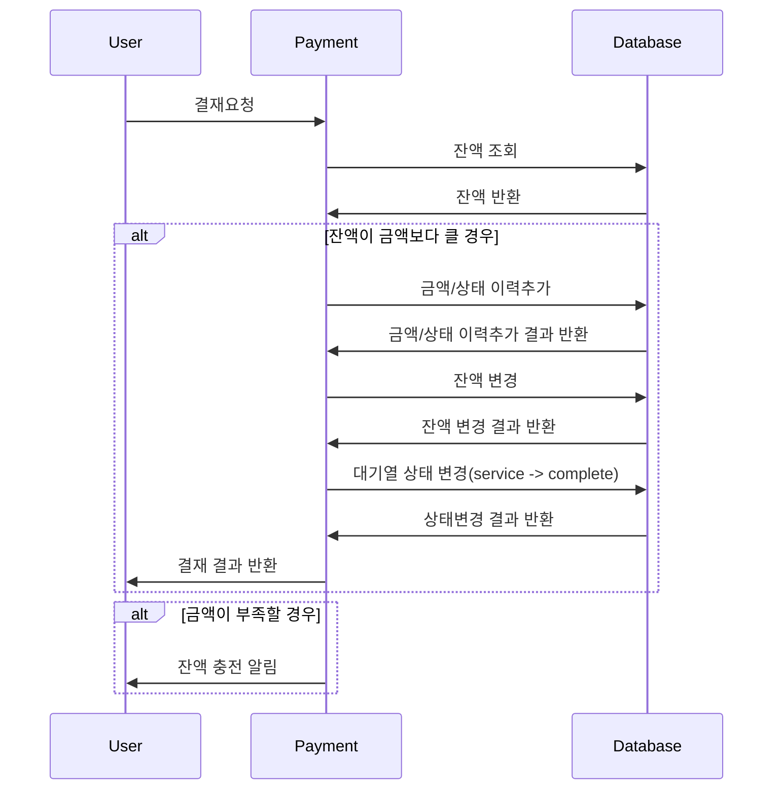
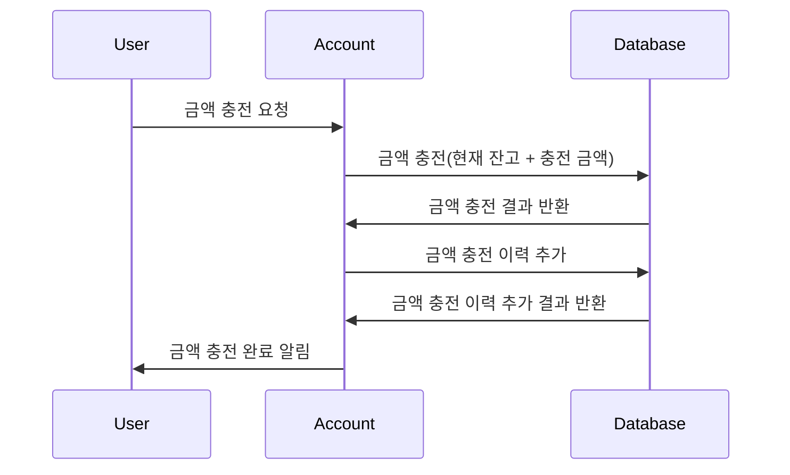
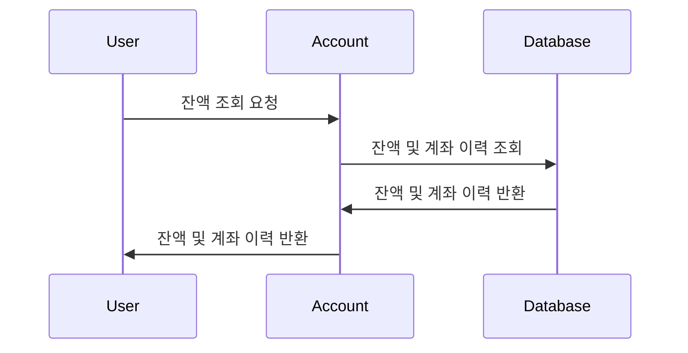

# 🎟️ 시퀀스 다이어그램
### 대기열 입장

```mermaid
sequenceDiagram
    participant User
    participant Book
    participant Queue
    participant Database
    participant Scheduler

    User ->> Book: 티켓 페이지 진입 전 대기열 진입 요청
    Book ->> Queue: 대기열 순서 등록 요청
    Queue ->> Database: 대기열 순서/상태(wait) 등록
    Database -->> Queue: 대기열 순서/상태 반환
    Queue -->> Book: 대기열 순서 반환
    Book -->> User: 대기열 순서 반환

    loop 대기열 순서 조회 (반복)
        Book ->> Queue: 일정 주기마다 유저의 상태 및 대기열 상태 확인 요청
        Queue ->> Database: 유저의 상태 및 대기열 상태 확인
        Database -->> Queue: 유저의 상태 및 대기열 상태 반환
        Queue -->> Book: 유저의 상태 및 대기열 상태 반환
    end

    alt 대기 상태에서 서비스 상태로 변경
        Scheduler ->> Database: 대기 시간 만료 후 유저 대기 상태 변경 (wait -> service)
        Database -->> Queue: 유저의 상태 변경
    end

    alt 유저 상태가 서비스로 변경된 경우
        Queue -->> Book: 유저 상태가 서비스로 변경됨
        Book -->> User: 서비스 페이지 반환
    end

    alt 대기 상태 분류 후 일정 시간 경과 시 상태 변경
        Scheduler ->> Database: 유저 상태 변경 (service -> complete)
        Database -->> Queue: 유저의 상태 변경 결과 반환
        Queue -->> User: 시간 만료 알림
    end
```
---
### 콘서트 일정 조회

```mermaid
sequenceDiagram
    participant User
    participant Concert
    participant Queue
    participant Database

    User ->> Concert: 콘서트 리스트 조회 요청
    Concert ->> Queue: 유저토큰 상태 조회 요청
    Queue ->> Database: 유저토큰 상태 조회
    Database ->> Queue: 유저토큰 상태 반환
    Queue ->> Concert: 유저토큰 상태 반환

    alt 유저토큰 상태가 service일 경우
    Concert ->> Database: 콘서트 리스트 및 예약 가능 여부 조회
    Database ->> Concert: 콘서트 리스트 및 예약 가능 여부 반환
    Concert ->> User: 콘서트 리스트 및 예약 가능 여부 노출
    end

    alt 대기열 상태가 complete일 경우
    Concert ->> User: 사용시간 만료 알림
    end  
```
---
### 콘서트 좌석 조회

```mermaid
sequenceDiagram
    participant User
    participant Concert
    participant Database

    User ->> Concert: 콘서트 리스트 조회 요청
    Concert ->> Queue: 유저토큰 상태 조회 요청
    Queue ->> Database: 유저토큰 상태 조회
    Database ->> Queue: 유저토큰 상태 반환
    Queue ->> Concert: 유저토큰 상태 반환


    alt 유저토큰의 상태가 service일 경우
    User ->> Concert: 예약 가능한 좌석 요청
    Concert ->> Database: 예약 가능한 좌석 검색
    Database ->> Concert: 예약 가능한 좌석 반환
    Book ->> User: 예약 가능한 좌석 반환
    end
    
    alt 유저토큰의 상태가 complete일 경우
    Concert ->> User: 사용시간 만료 알림
    end
```
---
### 결재 요청

```mermaid
sequenceDiagram
    participant User
    participant Payment
    participant Database

    User ->> Payment: 결재요청
    Payment ->> Database: 잔액 조회
    Database ->> Payment: 잔액 반환

    alt 잔액이 금액보다 클 경우
    Payment ->> Database: 금액/상태 이력추가
    Database ->> Payment: 금액/상태 이력추가 결과 반환
    Payment ->> Database: 잔액 변경
    Database ->> Payment: 잔액 변경 결과 반환
    Payment ->> Database: 대기열 상태 변경(service -> complete)
    Database ->> Payment: 상태변경 결과 반환
    Payment ->> User: 결재 결과 반환
    end
    
    alt 금액이 부족할 경우
        Payment ->>  User: 잔액 충전 알림
    end
```
---
### 금액 충전

```mermaid
sequenceDiagram
    participant User
    participant Account
    participant Database

    User ->> Account: 금액 충전 요청
    Account ->> Database: 금액 충전(현재 잔고 + 충전 금액)
    Database ->> Account: 금액 충전 결과 반환
    Account ->> Database: 금액 충전 이력 추가
    Database ->> Account: 금액 충전 이력 추가 결과 반환
    Account ->> User: 금액 충전 완료 알림


```
---
### 잔액 조회

```mermaid
sequenceDiagram
    participant User
    participant Account
    participant Database

    User ->> Account: 잔액 조회 요청
    Account ->> Database: 잔액 및 계좌 이력 조회
    Database ->> Account: 잔액 및 계좌 이력 반환
    Account ->> User: 잔액 및 계좌 이력 반환


```
