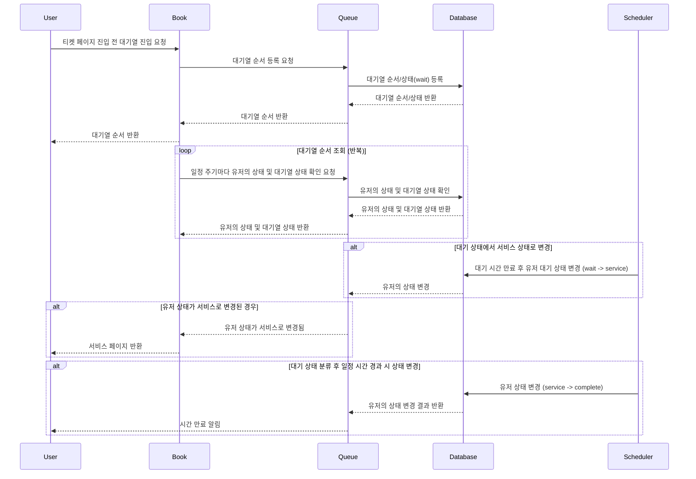
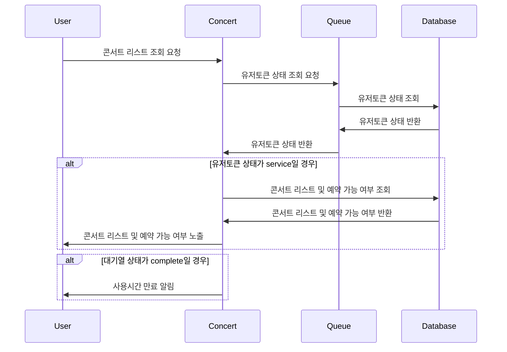
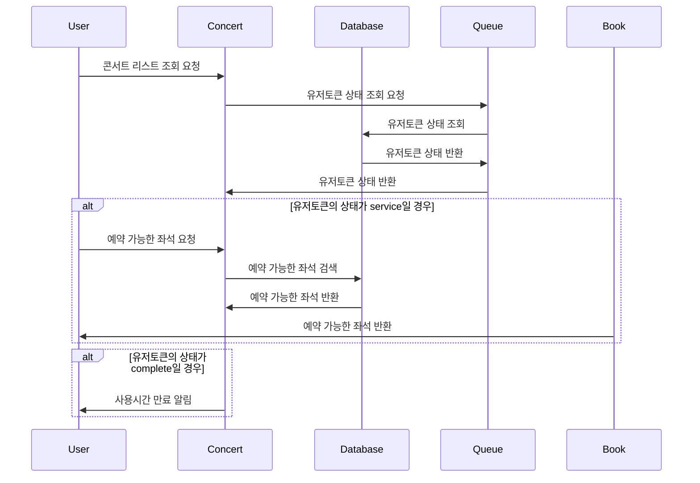
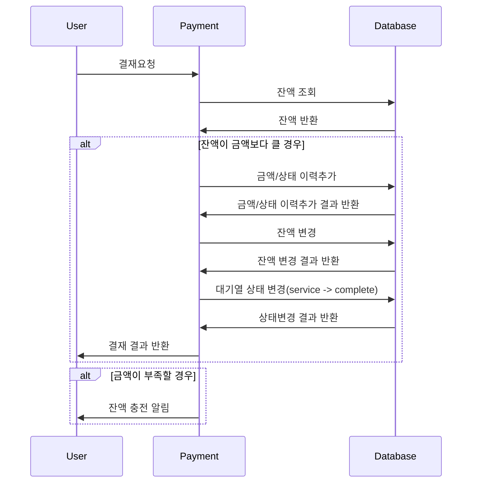
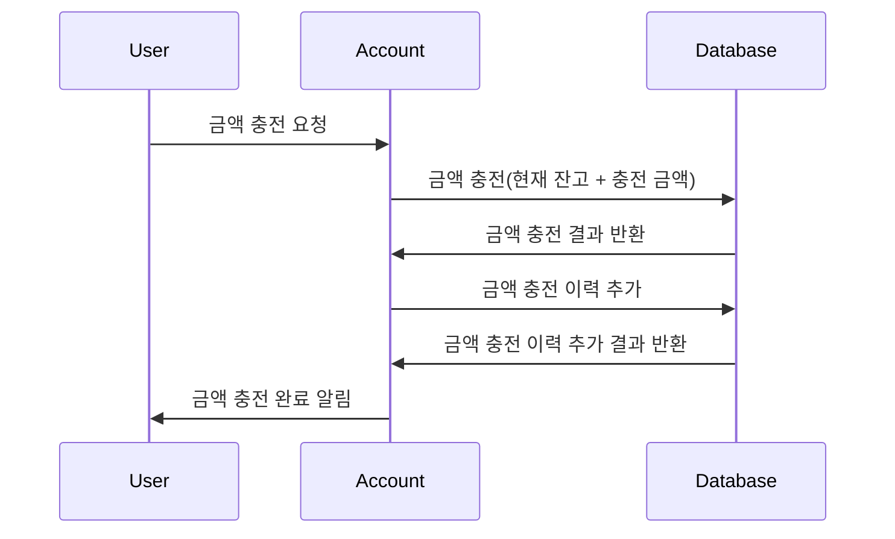
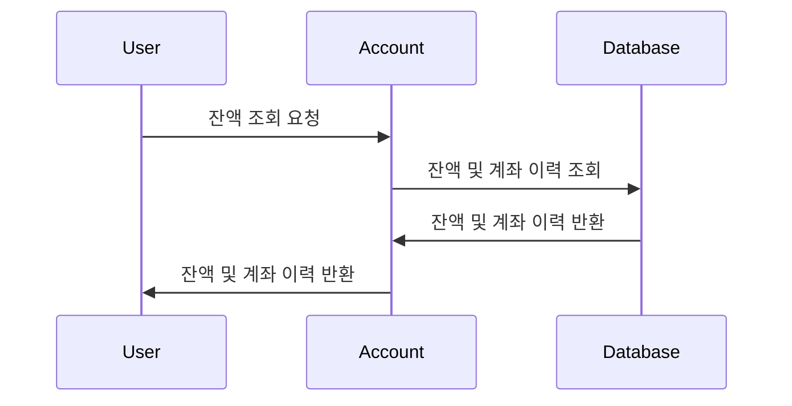

# 🎟️ 시퀀스 다이어그램
### 대기열 입장

---
### 콘서트 일정 조회

---
### 콘서트 좌석 조회

---
### 결재 요청

---
### 금액 충전

---
### 잔액 조회

---
<br><br>
# 🎟️ 콘서트 티켓팅 프로젝트 API 명세서
---
### 1. 대기열 진입 (Queue Entry)
- **URL**: `/queues`
- **Method**: `POST`
- **Description**: 대기열에 진입하면서 대기 상태의 유저 토큰을 생성하고 반환
- **Response:**
  - **성공 (200)**:
    ```json
    {
      "userToken": "qlekjr2...",
      "tokenStatus": "wait"
      "message": "현재 대기열은 n명입니다."
    }
    ```
  - **실패 (400 Bad Request)**:
    ```json
    {
      "error": "대기열에 진입할 수 없습니다."
    }
    ```
---
### 2. 콘서트 날짜 조회 (Concert Date Lookup)
- **URL**: `/concerts/:concertId/dates`
- **Method**: `GET`
- **Description**: 특정 콘서트의 예약 가능한 날짜 조회
- **Headers:**
```json
  Authorization: {token}
```
- **Path Parameters:**
```json
  concertId: string
```
- **Response:**
  - **성공 (200)**:
  ```json
  {
    "availableDates": [2024/10/7, 2024/10/14, 2024/10/19]
  }
  ```
  - **실패 (401 Unauthorized)**:
  ```json
  {
    "error": "해당 서비스를 이용하실 수 없습니다."
  }
  ```
  - **실패 (404 Not Found)**:
  ```json
  {
    "error": "해당 콘서트 정보를 찾을 수 없습니다."
  }
  ```

---

### 3. 콘서트 좌석 조회 (Concert Seat Lookup)
- **URL**: `/concerts/:concertId/dates/:date/seats`
- **Method**: `GET`
- **Description**: 콘서트 ID와 날짜에 해당하는 예약 가능한 좌석 수를 반환
- **Headers:**
```json
  Authorization: {token}
```
- **Path Parameters:**
```json
    concertId: string,
    date: string
```
- **Response:**
  - **성공 (200)**:
  ```json
  {
    "availableSeats": [
      { "seatId": seatId1, "seatNum": 1 },
      { "seatId": seatId2, "seatNum": 2 },
      { "seatId": seatId3, "seatNum": 3 }
    ]
  }
  ```
  - **실패 (401 Unauthorized)**:
  ```json
  {
    "error": "해당 서비스를 이용하실 수 없습니다."
  }
  ```
  - **실패 (404 Not Found)**:
  ```json
  {
    "error": "해당 콘서트 정보를 찾을 수 없습니다."
  }
  ```

---

### 4. 콘서트 좌석 임시 예약 (Concert Seat Temporary Reservation)
- **URL**: `/concerts/:concertId/schedules/:scheduleId/seats/:seatId/ticket`
- **Method**: `POST`
- **Description**: 특정 ticketId를 userId가 임시로 점유
- **Headers:**
```json
  Authorization: {token}
```
- **Request Body:**
```json
{
  "ticketId": "ticketId1",
  "userId": "1"
}
```
- **Response:**
  - **성공 (200)**:
  ```json
  {
    "ticketId": 1,
    "userId": 1
    "concertDate": 2024-10-11,
    "concertSeat": 1,
    "seatStatus": "temp"
  }
  ```
  - **실패 (401 Unauthorized)**:
  ```json
  {
    "error": "해당 서비스를 이용하실 수 없습니다."
  }
  ```
  - **실패 (404 Not Found)**:
  ```json
  {
    "error": "해당 콘서트 정보를 찾을 수 없습니다."
  }
  ```
---
### 5. 금액 충전 (Balance Charge)
- **URL**: `/payments/charges`
- **Method**: `PATCH`
- **Description**: 특정 userId의 계좌에 amount만큼 충전 및 이력 추가
- **Headers:**
```json
  Authorization: {token}
```

- **Request Body:**
```json
{
  "userId": "userId1",
  "amount": "50000"
}
```
- **Response:**
  - **성공 (200)**:
  ```json
  {
    "userName": "userName1",
    "amount": 50000,
    "point": 100000,
    "accountStat": "충전완료",
    "regDate": Date.now()
  }
  ```
  - **실패 (401 Unauthorized)**:
  ```json
  {
  "error": "해당 유저 정보를 찾을 수 없습니다."
  }
  ```
  - **실패 (404 Not Found)**:
  ```json
  {
  "error": "충전할 수 없는 금액입니다."
  }
  ```
---

### 6. 잔액 조회 요청 (Balance Inquiry)
- **URL**: /payments/:userId/accounts
- **Method**: GET
- **Description**: 특정 userId의 point 반환
- **Headers:**
```json
  Authorization: {token}
```
- **Request Body:**
```json
{
  "userId": "userId1",
  "amount": "40000"
}
```
- **Response:**
  - **성공 (200)**:
  ```json
  {
    "userName": "userName",
    "point": 150000
  }
  ```
  - **실패 (401 Unauthorized)**:
  ```json
  {
    "error": "해당 유저 정보를 찾을 수 없습니다."
  }
  ```
  - **실패 (404 Not Found)**:
  ```json
  {
    "error": "조회할 수 없는 잔액입니다."
  }
  ```
  ---

### 7. 결제 요청 (Payment Request)
- **URL**: /payments/pays
- **Method**: POST
- **Description**: 특정 ticket에 대한 결제 및 이력 추가
- **Headers:**
```json
  Authorization: {token}
```
- **Request Body:**
```json
  {
    "ticketId": "1",
    "userId": "1"
  }
```
- **Response:**
  - **성공 (200)**:
  ```json
  {
    "ticketId": "ticketId",
    "userName": "userName",
    "concertTitle": "concertTitle",
    "concertDate": 2024-10-11,
    "concertSeat": 1,
    "stat": "booked",
    "tokenStat": "expire"
  }
  ```
  - **실패 (401 Unauthorized)**:
  ```json
  {
    "error": "해당 티켓 정보를 찾을 수 없습니다."
  }
  ```
  - **실패 (404 Not Found)**:
  ```json
  {
    "error": "임시 점유 시간이 만료되었습니다."
  }
  ```
